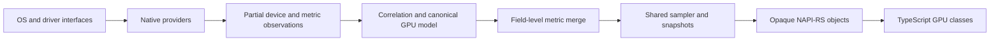

# Architecture

`let-smi` is split at boundaries that keep operating-system details, canonical
telemetry, and the public Node API independent. Provider-specific types never
cross the native boundary.

## Native providers

Every provider implements inventory and telemetry independently. Inventory
returns partial `DeviceObservation` records; telemetry returns metric values or
explicit unavailable observations. A provider is never required to implement
every metric, and a provider failure is isolated from the other providers.

The default monitor registers only providers compiled for the current OS. OS
frameworks are called directly. Optional vendor runtimes such as NVML are loaded
at runtime, so their absence cannot prevent the addon from loading. The runtime
source contains no command execution path.

Provider handles are opened once per monitor, retained across samples, and shut
down deterministically. Identity enumeration is cached until `refresh()` rather
than repeated for each sample.

## Canonical identity and correlation

The core correlates observations before exposing devices. Strong identifiers
are considered ahead of heuristics:

1. vendor UUID;
2. normalized PCI domain, bus, device, and function;
3. Windows adapter LUID and PNP identifier;
4. macOS IORegistry and Metal registry identifiers;
5. an explicit vendor/name/ordinal tuple only when observations come from
   distinct providers.

Known conflicting vendors are never merged. Within a correlated cluster,
identity fields are selected by provider identity priority, while memory and
capabilities are merged field-by-field. Parent/partition references are resolved
after all canonical IDs exist.

The public ID is a BLAKE3 digest of the strongest stable fingerprint available,
prefixed with the vendor. It does not contain a raw pointer or array index.
Enumeration order therefore does not affect IDs. An OS that exposes only a
session-scoped identifier can still change an ID after a reboot or driver reset;
that limitation is surfaced in the provider documentation rather than hidden.

## Metrics, availability, and provenance

Metric observations carry the canonical device ID, metric key, typed value,
provider ID, quality, timestamp, optional measured interval, and definition.
Unavailable observations carry a reason and optional provider/message. Numeric
zero is always a valid value and is never used as an unavailable sentinel.

The merge engine groups candidates by metric field. Its score incorporates:

- an explicit provider priority for that metric;
- provider specificity and reliability;
- `direct`, `derived`, or `estimated` quality;
- sample freshness.

Candidates older than 30 seconds are diagnostic candidates but cannot win.
Invalid values (including non-finite numbers, negative byte/power/clock values,
or ordinary percentages outside 0–100) become `provider-error`. Diagnostics
retain every candidate score and the winner, so selection decisions are
inspectable.

Provider priority is data in `ProviderMetadata`; it is not a platform-wide
switch. This allows, for example, DXGI identity, PDH utilization, and a future
ADLX sensor reading to contribute to one AMD GPU.

## Sampling and concurrency

Each monitor owns one named Rust sampler thread. JavaScript never calculates
counter deltas and no listener receives a private vendor handle. Commands sent
to the worker cover one-shot samples, subscriptions, refresh, cancellation, and
shutdown.

Counter-based providers retain baselines inside their provider state. A one-shot
sample with a positive `windowMs` retries a `first-sample` result after that
window. Continuous subscriptions sample at the fastest due interval and deliver
through a single-value slot. Slow consumers therefore receive the latest value
instead of causing an unbounded queue. Nearby listeners for the same GPU and
process option share a recent native poll.

`SampleSubscription::next` is a Rust `Future` backed by a stored waker; it does
not occupy a libuv worker while waiting. Cancellation and monitor shutdown
close the slot and wake pending consumers immediately. The command channel is
bounded to 256 entries, each subscription permits one in-flight `next()`, and a
monitor accepts at most 128 native subscriptions. Subscription storage is one
coalescing snapshot, never an unbounded event queue.

Provider access is serialized by the sampler and provider-local locks.
`close()` is idempotent, stops subscriptions, and normally joins the sampler
before releasing provider handles. It has a two-second exceptional bound: a
vendor call that never returns is detached rather than followed by an
unconditional join. A GC finalizer only requests nonblocking cancellation; the
sampler retains provider ownership and performs shutdown on its own thread.

## NAPI-RS boundary

The addon exports opaque `NativeMonitor` and `NativeSubscription` classes plus
`openMonitor()`. They own Rust values through safe reference-counted objects; no
raw pointer, numeric handle registry, or JavaScript environment is stored
globally.

The boundary is deliberately data-oriented:

- `listGpus()` returns canonical descriptors;
- `sampleGpu()` returns a snapshot;
- `subscribeGpu()` returns an object with `next()` and `cancel()`;
- `vendorInfo()`, `diagnostics()`, `refresh()`, and `close()` are explicit.

Open, one-shot sample, refresh, diagnostics, vendor information, and explicit
close run on NAPI-RS's Tokio blocking runtime rather than the JavaScript thread
or libuv worker pool. Subscription `next()` awaits the native waker-driven
future directly. TypeScript owns the public class hierarchy, validates every
native payload, and implements the `AsyncIterable` with `try/finally`
cancellation. Vendor subclasses use composition around the monitor client
rather than mirroring provider classes.

## Package layout

- `crates/gpu-core`: canonical model, correlation, merge, sampler, diagnostics,
  and native providers;
- `crates/gpu-napi`: the Node-API boundary;
- `packages/gpu`: the single public npm package and custom native loader;
- CI-generated `packages/gpu/npm/*`: platform packages containing one `.node`
  file each.

The custom loader uses `process.report` to distinguish glibc and musl. It never
executes `ldd`, `getconf`, or an install-time downloader. A normal consumer gets
the matching optional package and needs neither Rust nor a compiler toolchain.

## Refresh and future providers

`refresh()` reruns inventory/correlation and invalidates the TypeScript GPU
cache. Existing subscriptions to a removed device fail rather than silently
moving to an array neighbor. The identity and partition model already supports
MIG, vGPU, SR-IOV, and tile parentage.

New providers should emit observations through the existing traits, declare
runtime-probed capabilities, assign per-field metadata priorities, and avoid
adding provider-specific fields to the generic snapshot. Advanced data belongs
in the vendor-info object behind the stable TypeScript schema.
